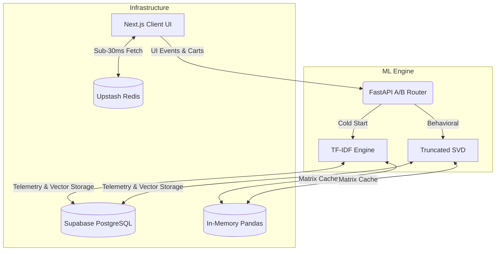

# LOTUS: Full-Stack E-Commerce Platform & ML Recommendation System
Full-stack e-commerce platform featuring a custom dual-model recommendation engine and parallel CI/CD deployment pipelines.

## 🔗 Links
**Live Demo:** [Insert Vercel URL] | **GitHub:** [Insert GitHub URL]

## 🛠️ Tech Stack
     

## System Architecture



### Frontend & Infrastructure
- **UI:** Next.js 14, React Server Components, Tailwind CSS
- **Database:** Supabase PostgreSQL
- **Caching:** Upstash Redis (frontend), Pandas in-memory (ML backend)
- **DevOps:** Parallel GitHub Actions CI/CD (Frontend & ML Backend), automated testing (pytest), linting, and security auditing.

### ML Backend (Python FastAPI)
- **Collaborative Filtering:** Mean-centered Truncated SVD
- **Content-Based Filtering:** TF-IDF + Cosine Similarity (cold-start fallback)
- **A/B Router:** Probabilistic model selection and experimentation infrastructure
- **Data Pipeline:** Stateful event tracking (views, wishlists, cart additions)

## Technical Challenge: Sparse Matrix Problem
**Problem:** Standard collaborative filtering fails on highly sparse data.
- Dataset: 50,000 interactions (25,127 users × 3,262 products)
- Matrix sparsity: 99.93%
- Initial baseline: MAE 4.02 (naive SVD predictions collapsed toward zero)

**Solution:** Mean-centering preprocessing before matrix factorization.
1. Center ratings around each user's average
2. Train SVD on centered values
3. Add user means back to predictions

**Result:** MAE 0.3681

```text
📊 EVALUATION METRICS
==================================================
Dataset: UCSD Amazon Reviews (Clothing, Shoes & Jewelry)
Sample Size: 50,000 interactions
Matrix Sparsity: 99.93%
--------------------------------------------------
Popularity Baseline MAE: 0.5536
Collaborative SVD MAE: 0.3681
Collaborative SVD RMSE: 0.6547
==================================================
```