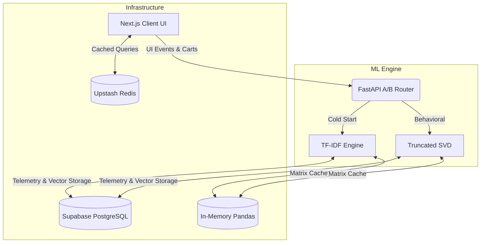

# LOTUS: Full-Stack E-Commerce Platform & ML Recommendation System

Full-stack e-commerce platform featuring a custom dual-model recommendation engine and parallel CI/CD deployment pipelines.

## 🔗 Links

**Live Demo:** [Insert Vercel URL] | **GitHub:** [Insert GitHub URL]

## 🛠️ Tech Stack

     

## System Architecture



### Frontend & Infrastructure

- **UI:** Next.js 14, React Server Components, Tailwind CSS
- **Database:** Supabase PostgreSQL
- **Caching:** Upstash Redis (frontend), Pandas in-memory (ML backend)
- **DevOps:** Parallel GitHub Actions CI/CD (Frontend & ML Backend), automated testing (pytest), linting, and security auditing

### ML Backend (Python FastAPI)

- **Collaborative Filtering:** Mean-centered Truncated SVD
- **Content-Based Filtering:** TF-IDF + Cosine Similarity (cold-start fallback)
- **A/B Router:** Probabilistic model selection and experimentation infrastructure
- **Data Pipeline:** Stateful event tracking (views, wishlists, cart additions)

## Technical Challenge & Optimization Tradeoff: Sparse Matrix Factorization

**Problem:** Standard collaborative filtering fails on highly sparse data. 
- Dataset: UCSD Amazon Reviews (Clothing, Shoes & Jewelry)
- Sample Size: 50,000 interactions (99.93% matrix sparsity)
- Architecture Question: Does an iterative deep learning approach (Stochastic Gradient Descent) mathematically outperform closed-form linear algebra (Truncated SVD) on extreme sparsity?

**Solution & Benchmark:** Implemented an L2-Regularized SGD model alongside the baseline Truncated SVD model. Both were standardized with statistical mean-centering to prevent predictions from collapsing toward zero. Conducted a rigorous paired t-test on absolute prediction errors to evaluate the tradeoff between statistical accuracy and computational latency.

**Result:** ```text
📊 SCIENTIFIC BENCHMARK RESULTS (Mean-Centered)
==================================================
SVD Model | MAE: 0.8774 | RMSE: 1.2521 | Training Time: ~17.5 sec
SGD Model | MAE: 0.8778 | RMSE: 1.2521 | Training Time:  ~9.7 sec
--------------------------------------------------
🔬 STATISTICAL SIGNIFICANCE (Paired t-test)
Mean Error Difference (SVD - SGD): -0.000418
95% Confidence Interval: [-0.000471, -0.000366]
p-value: 1.91e-54
==================================================
```

**Architectural Verdict:** While the paired t-test confirmed SVD's mathematical superiority is statistically significant, the absolute MAE improvement of 0.0004 is practically negligible for user-facing recommendations (less than a 0.01% relative error reduction on a 5-star scale). Conversely, the computational tradeoff is severe: SVD required nearly 2x the training latency of SGD. This empirical evaluation demonstrates that marginal statistical improvements must be weighed against computational cost. Given the negligible practical gain relative to increased latency, escalating to deeper neural architectures (NCF) was rejected in favor of a pragmatic, latency-optimized production deployment.

## Local Development Setup

### Prerequisites

- Node.js 18+
- Python 3.11+
- Supabase account
- Upstash Redis account

### Installation

**1. Clone the repository**
```bash
git clone [https://github.com/yourusername/lotus-shop](https://github.com/yourusername/lotus-shop)
cd lotus-shop
```

**2. Install frontend dependencies**
```bash
npm install
```

**3. Install ML backend dependencies**
```bash
cd ml-api
pip install -r requirements.txt
cd ..
```

**4. Configure environment variables**
```bash
# Copy example files
cp .env.example .env.local
cp ml-api/.env.example ml-api/.env

# Add your credentials to both files
```

**5. Run the development servers**
```bash
# Terminal 1: Frontend
npm run dev

# Terminal 2: ML Backend
cd ml-api
python -m uvicorn main:app --reload
```

**6. Access the application**
- Frontend: http://localhost:3000
- ML API: http://localhost:8000
- API Docs: http://localhost:8000/docs

## Security & Environment Variables

This project uses environment variables for all API credentials:

**Local Development:**
- Copy `.env.example` to `.env.local`
- Add your actual credentials
- `.env.local` is excluded from Git via `.gitignore`

**Production:**
- Set environment variables in Vercel/Railway dashboard
- Never commit credentials to version control

**Data Protection:**
- Row Level Security (RLS) policies enforce access control at the database level
- Supabase authentication manages user sessions
- All sensitive data queries are protected by RLS rules

**Note:** Earlier commits may contain API keys from initial development. 
Current architecture uses environment variables exclusively.

## CI/CD Pipeline

Automated testing and deployment via GitHub Actions:

**Frontend Pipeline:**
- Security audit (npm audit)
- Unit tests (Jest)
- Production build validation
- Deployment to Vercel

**ML Backend Pipeline:**
- Code quality checks (flake8)
- Security scanning (safety)
- Unit tests (pytest)
- Deployment to Railway

## Project Structure
```text
lotus-shop/
├── app/                    # Next.js pages and components
├── lib/                    # Utility functions
├── ml-api/                 # Python FastAPI backend
│   ├── main.py            # API routes
│   ├── collaborative.py   # Collaborative filtering
│   ├── recommender.py     # Content-based filtering
│   └── tests/             # Backend tests
├── .github/workflows/     # CI/CD configuration
└── README.md
```

## License

MIT License - see LICENSE file for details