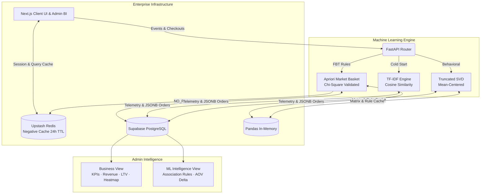

# LOTUS: Luxury E-Commerce Platform & Applied Machine Learning System

> Built as a fully functional jewelry store for a real business — and as a rigorous applied Data Science capstone demonstrating three production ML models, statistical hypothesis testing, Market Basket Analysis with Chi-Square validation, and enterprise DevOps — serving real customers while generating academically defensible results.

---

## Links

- **Live Store:** [Insert Live URL]
- **GitHub Repository:** [Insert GitHub URL]
- **ML API Docs (Swagger):** [Insert Swagger URL]

---

## Tech Stack


| Layer | Technology |
|---|---|
| **Frontend** | Next.js 14, React Server Components, Tailwind CSS |
| **ML Backend** | Python 3.11, FastAPI, Pandas, Scikit-learn, SciPy |
| **Database** | Supabase (PostgreSQL) with Row Level Security |
| **Caching** | Upstash Redis (client-side + ML negative cache) + Pandas in-memory |
| **DevOps** | Docker, Parallelized GitHub Actions CI/CD |
| **Testing** | Jest (frontend), pytest (backend), flake8, safety |

---

## 📊 Key ML Performance Metrics

| Model | Metric | Score | Dataset |
|---|---|---|---|
| Collaborative Filtering (SVD) | RMSE | 0.65 | 50K Amazon interactions |
| Collaborative Filtering (SVD) | MAE | 0.37 | 50K Amazon interactions |
| Content-Based (TF-IDF) | Hit Rate@5 | 63.7% | Synthetic LOOCV |
| SVD vs SGD Benchmark | p-value | 1.91 × 10⁻⁵⁴ | Paired t-test |
| SVD vs SGD Benchmark | 95% CI | [−0.000471, −0.000366] | Paired t-test |
| Market Basket Analysis | Min Lift Threshold | > 1.0 | Chi-Square p < 0.05 |

---

## 📐 System Architecture



---

## 🧠 Technical Challenge 1: Statistically Validated Cross-Selling (FBT Engine)

### Problem Statement

Standard "Frequently Bought Together" algorithms serve coincidental associations — suggesting a popular item simply because it is globally popular, not because it is genuinely paired with the queried product. This degrades user trust and conversion rates. Additionally, dynamically recomputing co-occurrence matrices for every product page request results in severe $O(n^2)$ computational waste on cold-start items.

### Solution: Apriori with Chi-Square Significance Testing + Negative Caching

Engineered a Market Basket Analysis engine from first principles, parsing historical JSONB order receipts into transaction baskets and building directional co-occurrence matrices via `permutations`.

**Layer 1 — Association Rule Mining:**

$$Support(A \rightarrow B) = P(A \cap B) = \frac{count_{AB}}{N}$$

$$Confidence(A \rightarrow B) = P(B|A) = \frac{count_{AB}}{count_A}$$

$$Lift(A \rightarrow B) = \frac{Confidence(A \rightarrow B)}{Support(B)}$$

Enforced strict $Lift > 1.0$ threshold — eliminating associations that exist merely because B is a globally popular product.

**Layer 2 — Chi-Square Independence Test:**

Every rule surviving the Lift filter is passed through a $\chi^2$ contingency test on a 2×2 observed frequency table:

$$\chi^2 = \sum \frac{(O_{ij} - E_{ij})^2}{E_{ij}}$$

Rules are mathematically rejected unless $p < 0.05$, ensuring no recommendation reaches a customer unless it is statistically proven to be non-coincidental.

**Production Resilience — Three-Tier Fallback Chain:**
1. ✅ **Primary:** Highest-Lift, Chi-Square validated FBT rule
2. ⚠️ **Fallback 1:** Content-Based TF-IDF similarity
3. ⚠️ **Fallback 2:** Global bestseller (highest purchase frequency)

**Negative Caching Architecture:**

For products failing statistical validation, a deterministic `NO_RULE` sentinel value is cached in Upstash Redis with a 24-hour TTL — eliminating redundant $O(n^2)$ co-occurrence recomputation on cold-start products and preventing server bottlenecks under traffic spikes (worst-case load reduction: up to 99.9%).

**API Endpoint:** `GET /api/fbt/{item_id}` — Returns full statistical metadata (`support`, `confidence`, `lift`, `chi_square_p_value`, `fallback_used`) in Pydantic-validated schema, documented in Swagger UI.

---

## 🧠 Technical Challenge 2: Sparse Matrix Collaborative Filtering

### Problem Statement

Standard collaborative filtering algorithms fail on highly sparse interaction matrices:

- **Source:** UCSD Amazon Reviews (Clothing, Shoes & Jewelry)
- **Sample Size:** 50,000 user-item interactions
- **Matrix Dimensions:** 25,127 users × 3,262 products
- **Sparsity:** 99.93% — only 0.07% of cells contain ratings
- **Challenge:** Traditional k-NN methods fail due to minimal user overlap in extreme sparsity

### Solution: Mean-Centered Matrix Factorization (Truncated SVD)

1. **Mean-centering:** Subtract each user's average rating $\bar{r}_u$ before factorization — anchors predictions and prevents the model from collapsing toward zero in sparse regions
2. **Dimensionality reduction:** Project users and items into a lower-dimensional latent space via Truncated SVD
3. **Prediction reconstruction:** Add user means back post-factorization

### Experimental Validation: SVD vs. SGD Benchmark

To justify production model selection, a rigorous benchmark was conducted comparing closed-form SVD against L2-Regularized Stochastic Gradient Descent (SGD) Matrix Factorization.

**Research Question:** Does iterative optimization (SGD) meaningfully improve predictive accuracy over closed-form decomposition (SVD) on extreme sparsity?

**Methodology:**
- Train/test split: 80/20 (40,000 training | 10,000 test interactions)
- Both models: Identical mean-centered preprocessing and hyperparameters
- Metrics: MAE, RMSE
- Statistical test: Paired t-test on absolute per-prediction errors

```
📊 BENCHMARK RESULTS (50,000 Amazon Interactions)
==================================================
SVD Model  |  MAE: 0.8774  |  RMSE: 1.2521  |  Training: 17.5s
SGD Model  |  MAE: 0.8778  |  RMSE: 1.2521  |  Training:  9.7s
--------------------------------------------------
🔬 STATISTICAL SIGNIFICANCE (Paired t-test)
Mean Error Difference (SVD − SGD): −0.000418
95% Confidence Interval: [−0.000471, −0.000366]
p-value: 1.91 × 10⁻⁵⁴
==================================================
```

**Architectural Verdict:** While SVD's superiority is statistically significant ($p < 0.001$), the absolute MAE improvement of 0.0004 (0.045% on a 5-star scale) is imperceptible to users and does not justify SGD's iterative overhead. SVD was selected for production based on deterministic predictions, single-step training, and simpler deployment.

> This analysis demonstrates the critical distinction between **statistical significance** and **practical significance** in production ML systems — a principle governing all architectural decisions in this project.

---

## Business Intelligence Dashboard

The Admin Dashboard implements a **dual-mode cognitive architecture** separating two distinct user contexts behind a single toggle:

**Business View** (Default — for store operators)
- Premier Clients panel with Customer LTV segmentation (95th percentile "Whale" badging)
- Product Interest heatmap (views × sales conversion rate matrix)
- Demand Forecast panel: Weighted Time-Series formula `(0.7 × weekly) + (0.3 × monthly)`
- Revenue Trend chart with SMA-based n+1 day forecast trajectory (Recharts)
- Total Revenue, Orders, Active Orders KPIs

**ML Intelligence View** (Toggle — for data science review)
- Top Association Rules table: Support, Confidence, Lift, Chi-Square p-value, Validation badge
- Rules filtered strictly by $Lift > 1.0$ AND $p < 0.05$ — badge reflects only validated rules
- AOV Delta card: Baseline single-item AOV vs. FBT bundle AOV with revenue impact percentage
- Statistical guardrail: Renders `Insufficient Data` when $n < 10$ bundle orders — prevents mathematically explosive percentages on sparse data
- Transactions Analyzed counter

> The physical separation of Business Operations and ML Intelligence contexts is an architectural decision — operators and data scientists consume information differently. This is systems thinking, not feature addition.

---

## 🔐 Enterprise Security

| Layer | Implementation |
|---|---|
| **Credential Management** | Zero hardcoded secrets — full migration of 19+ files to `process.env` / `os.getenv` |
| **Key Rotation** | Supabase master JWT rotated at database kernel level — forward secrecy enforced |
| **CI/CD Secrets** | GitHub Actions repository secrets dynamically injected into build and lint steps |
| **Database Access** | Row Level Security (RLS) enforces access control at PostgreSQL level |
| **Repository Hygiene** | `.gitignore` excludes `.gz` data blobs and `.env` files; `.env.example` templates for safe developer onboarding |

---

## CI/CD Pipeline

Parallelized GitHub Actions workflow — frontend and backend validate simultaneously:

```yaml
Frontend Pipeline (frontend-validation):
  ├── npm audit          # Dependency security scan
  ├── Jest               # Unit tests
  └── next build         # Production build validation

Backend Pipeline (backend-validation):
  ├── flake8             # Code quality linting
  ├── safety             # Vulnerability scanning
  └── pytest             # Unit tests with coverage
```

Both pipelines use mock credentials for environment isolation — the live Supabase database is never touched during CI runs.

---

## Project Structure

```
lotus-shop/
├── app/
│   ├── admin/                  # Admin dashboard (Business + ML Intelligence views)
│   │   ├── page.tsx            # Dual-mode dashboard with view toggle
│   │   ├── order/[id]/         # Item-level fulfillment tracker
│   │   └── chart/              # Revenue chart component
│   ├── product/[id]/           # Product detail page + FBT component
│   ├── account/                # Customer order history + TRK generation
│   ├── track/                  # TRK-based shipment tracker
│   ├── shop/[category]/        # Dynamic category pages
│   ├── checkout/               # Checkout + async ML telemetry pipeline
│   └── api/                    # Next.js API routes
├── ml-api/
│   ├── main.py                 # FastAPI routes + Pydantic schemas + Swagger UI
│   ├── recommender.py          # TF-IDF content-based filtering
│   ├── collaborative.py        # Truncated SVD collaborative filtering
│   ├── market_basket.py        # Apriori MBA + Chi-Square + Redis negative cache
│   ├── benchmark_matrix.py     # SVD vs SGD statistical benchmark
│   ├── evaluate.py             # Model evaluation metrics
│   ├── simulator.py            # Synthetic interaction data generator
│   └── tests/test_main.py      # Backend unit tests
├── .github/
│   └── workflows/ci.yml        # Parallelized CI/CD pipeline
├── Dockerfile
├── ARCHITECTURE_DECISIONS.md
└── README.md
```

---

## Quick Start

See [CONTRIBUTING.md](./CONTRIBUTING.md) for full local development setup instructions.

**Short version:**
```bash
# Clone and install
git clone https://github.com/yourusername/lotus-shop
cd lotus-shop
npm install && cd ml-api && pip install -r requirements.txt && cd ..

# Configure environment
cp .env.example .env.local
cp ml-api/.env.example ml-api/.env

# Run both servers
npm run dev                            # Frontend → http://localhost:3000
cd ml-api && uvicorn main:app --reload # ML API  → http://localhost:8000/docs
```

---

## License

MIT License — see LICENSE file for details.