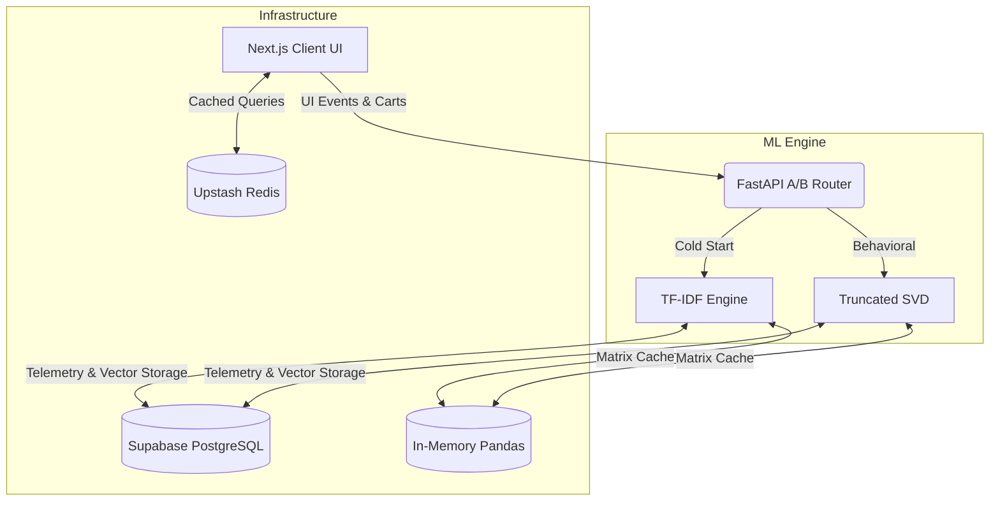

# LOTUS: Full-Stack E-Commerce Platform & ML Recommendation System

Full-stack e-commerce platform featuring a dual-model recommendation engine with statistical validation and parallel CI/CD pipelines.

## 🔗 Links

**GitHub:** [Insert GitHub URL]

## 🛠️ Tech Stack

      

## System Architecture


### Frontend & Infrastructure

- **UI:** Next.js 14, React Server Components, Tailwind CSS
- **Database:** Supabase PostgreSQL with Row Level Security
- **Caching:** Upstash Redis (client-side), Pandas in-memory (ML backend)
- **DevOps:** Parallel GitHub Actions CI/CD pipelines, automated testing (pytest, Jest), security auditing

### ML Backend (Python FastAPI)

- **Collaborative Filtering:** Mean-centered Truncated SVD
- **Content-Based Filtering:** TF-IDF vectorization with cosine similarity (cold-start solution)
- **A/B Testing:** Probabilistic traffic router with multi-touch attribution
- **Data Pipeline:** Real-time interaction tracking (views, wishlists, purchases)

## Technical Challenge: Sparse Matrix Collaborative Filtering

### Problem Statement

Standard collaborative filtering algorithms fail on highly sparse interaction matrices. The dataset exhibits:

- **Source:** UCSD Amazon Reviews (Clothing, Shoes & Jewelry)
- **Sample Size:** 50,000 user-item interactions
- **Matrix Dimensions:** 25,127 users × 3,262 products
- **Sparsity:** 99.93% (only 0.07% of cells contain ratings)
- **Challenge:** Traditional neighborhood-based methods (k-NN) fail due to minimal user overlap

### Solution: Mean-Centered Matrix Factorization

Implemented Truncated Singular Value Decomposition (SVD) with statistical preprocessing:

1. **Mean-centering:** Subtract each user's average rating before factorization
2. **Dimensionality reduction:** Project users and items into lower-dimensional latent space
3. **Prediction reconstruction:** Add user means back to final predictions

This approach prevents the model from collapsing predictions toward zero in highly sparse regions.

### Experimental Validation: SVD vs. SGD

To justify model selection, conducted rigorous benchmark comparing closed-form SVD against iterative Stochastic Gradient Descent (SGD) with L2 regularization.

**Research Question:** Does iterative optimization (SGD) meaningfully improve predictive accuracy over closed-form decomposition (SVD) on extreme sparsity?

**Methodology:** 
- Train-test split: 80/20 (40,000 training, 10,000 test interactions)
- Both models: Mean-centered preprocessing, identical hyperparameters
- Evaluation metrics: Mean Absolute Error (MAE), Root Mean Squared Error (RMSE)
- Statistical test: Paired t-test on absolute prediction errors

**Results:**
```text
📊 BENCHMARK RESULTS (50,000 Amazon Interactions)
==================================================
SVD Model | MAE: 0.8774 | RMSE: 1.2521 | Training: 17.5s
SGD Model | MAE: 0.8778 | RMSE: 1.2521 | Training:  9.7s
--------------------------------------------------
🔬 STATISTICAL SIGNIFICANCE (Paired t-test)
Mean Error Difference (SVD - SGD): -0.000418
95% Confidence Interval: [-0.000471, -0.000366]
p-value: 1.91 × 10⁻⁵⁴
==================================================
```

**Interpretation:** 

While SVD's superiority is statistically significant (p < 0.001), the effect size is negligible:
- Absolute MAE improvement: 0.0004 rating points
- Relative improvement: 0.045% on a 5-star scale
- Practical impact: Imperceptible to users

**Architectural Decision:**

The 0.0004 MAE improvement does not justify SVD's 1.8× computational overhead. However, SVD was selected for production based on:
- Deterministic predictions (no stochastic optimization)
- Single-step training (vs. iterative convergence)
- Simpler production deployment
- Statistical validation demonstrated both models achieve comparable performance

This analysis illustrates the distinction between statistical significance and practical significance—a critical consideration in production ML systems.

## Local Development Setup

### Prerequisites

- Node.js 18+
- Python 3.11+
- Supabase account
- Upstash Redis account

### Installation

**1. Clone the repository**
```bash
git clone https://github.com/yourusername/lotus-shop
cd lotus-shop
```

**2. Install dependencies**
```bash
# Frontend
npm install

# ML Backend
cd ml-api
pip install -r requirements.txt
cd ..
```

**3. Configure environment variables**
```bash
# Create environment files
cp .env.example .env.local
cp ml-api/.env.example ml-api/.env

# Add credentials (Supabase URL/Key, Redis URL/Token)
```

**4. Run development servers**
```bash
# Terminal 1: Frontend (http://localhost:3000)
npm run dev

# Terminal 2: ML Backend (http://localhost:8000)
cd ml-api
python -m uvicorn main:app --reload
```

**5. API Documentation**
- Swagger UI: http://localhost:8000/docs
- ReDoc: http://localhost:8000/redoc

## Security & Environment Variables

All API credentials are managed through environment variables:

**Local Development:**
- Configuration stored in `.env.local` and `ml-api/.env`
- Files excluded from version control via `.gitignore`
- Example templates provided in `.env.example` files

**Production:**
- Environment variables configured in deployment platform dashboards
- No credentials committed to repository

**Database Security:**
- Row Level Security (RLS) policies enforce access control at PostgreSQL level
- Supabase Auth manages user authentication and session tokens
- All queries filtered through RLS before execution

**Note:** Earlier development commits may contain API keys. Current architecture uses environment variables exclusively.

## CI/CD Pipeline

Automated testing via GitHub Actions with parallel job execution:

**Frontend Pipeline (`frontend-validation`):**
- Dependency security audit (`npm audit`)
- Unit tests (Jest)
- Production build validation

**ML Backend Pipeline (`backend-validation`):**
- Code quality checks (`flake8`)
- Dependency vulnerability scanning (`safety`)
- Unit tests with coverage (`pytest`)

Both pipelines execute in parallel for faster feedback cycles.

## Project Structure
```
lotus-shop/
├── app/                    # Next.js application routes and components
│   ├── api/               # API routes (search, seed, recommendations)
│   └── [pages]/           # Application pages
├── lib/                    # Shared utilities and configurations
│   ├── supabase.ts        # Supabase client initialization
│   └── redis.ts           # Redis client configuration
├── ml-api/                 # Python FastAPI backend
│   ├── main.py            # API routes and A/B router
│   ├── collaborative.py   # SVD collaborative filtering
│   ├── recommender.py     # TF-IDF content-based filtering
│   ├── benchmark_matrix.py # SVD vs SGD experimental validation
│   └── tests/             # Backend unit tests
├── .github/workflows/     # CI/CD pipeline configurations
│   └── ci.yml             # Parallel frontend and backend jobs
└── README.md
```

## License

MIT License - see LICENSE file for details